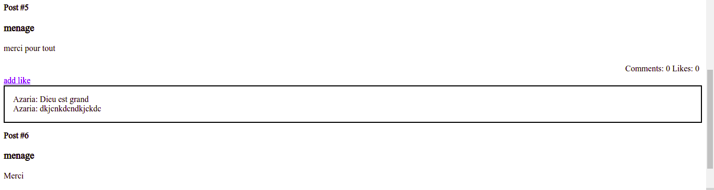

# Blog App

The Blog app will be a classic example of a blog website. We created a fully functional website that will show the list of posts and empower readers to interact with them by adding comments and liking posts.

## Built With

- Ruby on Rails
- Ruby
- RSpec

## Live Demo

[Live Demo Link](https://github.com/azy64/blog_app)

## Getting Started

To get a local copy up and running follow these simple example steps.

` 
git clone https://github.com/azy64/blog_app.git
`

and then run

`
bundle install
`

## Development

start of by creating the database and running migrations using `bin/rails db:setup`

to start the server run `bin/rails s`

## Testing

to test simply run `rspec`

## Authors

👤 **Author1**

- GitHub: [@azy64](https://github.com/azy64)
- LinkedIn: [azaria-saidi](https://www.linkedin.com/in/azaria-saidi-524780112/)

## 🤝 Contributing

Contributions, issues, and feature requests are welcome!

Feel free to check the [issues page](../../issues/).

## Show your support

Give a ⭐️ if you like this project!

## Acknowledgments

- Hat tip to anyone whose code was used
- Inspiration
- etc

## 📝 License

This project is [MIT](./MIT.md) licensed.